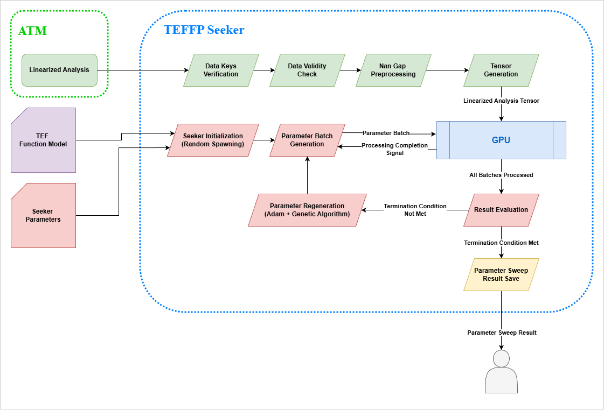

# TEFFP (Target Exposure Factor Function Parameters) Seeker


[](./README.ko.md)

---


### 📖 Project Introduction ###

**TEFFP Seeker** is a GPU-accelerated backtesting and parameter optimization engine built as a companion application to **[ATM-Eta](https://github.com/kimlvis31/AutoTradeMachine_Eta)**. It takes the analysis data exported from ATM-Eta, simulates a user-defined **TEF (Target Exposure Factor) function** against it across tens of thousands of parameter sets in parallel, and searches for the parameter set that best satisfies a user-selected scoring objective.

ATM-Eta can backtest a strategy on the CPU, but finding good parameters for that strategy means running the same simulation over and over with slightly different values. TEFFP Seeker moves that loop onto the GPU: every parameter set runs as its own lane of a custom **Triton** kernel, and a population-based, gradient-driven search explores the parameter space on top of it.

#### **Core Capabilities**
* **Massive Parallel Backtesting** — Each parameter set is simulated independently inside a Triton kernel, so thousands of full-length backtests over minute-level market data run concurrently on a single GPU.
* **Exchange-Faithful Trade Simulation** — The simulator mirrors the trading rules of ATM-Eta: tick/step/quote precision rounding, trading fees, isolated and cross margin accounting, full stop losses, and liquidation prices computed from Binance's tiered maintenance margin table.
* **Population-Based Gradient Search** — A population of *seekers* explores the parameter space using numerical gradients and Adam-style updates, while periodic repopulation replaces weak seekers to avoid getting trapped in local optima.
* **Configurable Scoring** — Candidates are scored by final balance, growth rate, volatility, or a Sharpe-ratio-like composite, with a maximum drawdown filter that rejects parameter sets exceeding a user-defined risk limit.
* **Pluggable TEF Functions** — Strategies are written as self-contained `teff_*.py` modules and discovered automatically at startup. The same TEF interface contract as ATM-Eta applies: analysis data in, target exposure out.
* **Direct Export to ATM-Eta** — The best parameter set from each search is exported as a ready-to-use ATM-Eta **Trade Configuration** file (`.tc`).

---


### ▶️ How To Run ###
Before running the application, **Python 3.11 or higher** and an **NVIDIA GPU** with an up-to-date driver must be installed on your system. On Windows, make sure Python is added to `PATH` during installation. All required libraries listed in `requirements.txt` are installed automatically into a virtual environment by the setup script.

#### **Windows** 🪟
1. Run `setup.bat` in the root directory. This will setup `.venv` and install any necessary libraries for this application.
2. Place the analysis data exported from ATM-Eta (`{name}_descriptor.json` and `{name}_data.npy`) under the `analysisData/` folder.
3. Set `MODE` and the corresponding configuration in `config.py` (see [Operating Modes](#operating-modes)).
4. Run `run.bat` in the root directory. This will start the application.

#### **Linux** 🐧
1. Execute the command `chmod +x setup.sh run.sh` in the terminal.
2. Run `setup.sh` in the root directory. This will setup `.venv` and install any necessary libraries for this application.
3. Place the analysis data exported from ATM-Eta (`{name}_descriptor.json` and `{name}_data.npy`) under the `analysisData/` folder.
4. Set `MODE` and the corresponding configuration in `config.py` (see [Operating Modes](#operating-modes)).
5. Run `run.sh` in the root directory. This will start the application.

> **Note:** Before each search in `SEEK` mode, Triton autotuning is warmed up for the batch sizes the search will use, which can take a few minutes.

---


### ✅ Requirements ###
* **Operating System**: Windows 10/11 or Linux
* **Python**:           Version `3.11` or higher
* **GPU**:              NVIDIA GPU with CUDA support
* **RAM**:              8GB or more
* **Storage**:          4GB or more

---


### 🧱 System Architecture ###

TEFFP Seeker sits downstream of ATM-Eta in the strategy development workflow. ATM-Eta handles market data collection and multi-timeframe analysis, then exports the analysis results as a flat, column-per-key dataset. TEFFP Seeker consumes that dataset, searches for optimized TEF function parameters on the GPU, and hands the result back to ATM-Eta as a Trade Configuration.



The diagram above shows the flow of a single search. It consists of three stages:

* **Data preparation** — The Linearized Analysis exported from ATM-Eta is checked for the price and analysis keys the selected TEF function requires, trimmed to its first valid close price, gap-filled, and converted into contiguous GPU tensors. This happens once per search target.
* **Search loop** — Using the seeker parameters in `config.py`, seekers are spawned at random positions within the parameter ranges defined by the trade parameters and the TEF function model. At each step, test parameter sets are generated from the seekers' current positions and dispatched to the GPU in batches. Once all batches are processed, the results are scored, and the seekers are moved by an Adam-style optimizer combined with genetic-algorithm-like repopulation. The loop repeats until the termination condition is met.
* **Result output** — The best parameter set and the history of improvements are saved, and the best set of each target is exported as an ATM-Eta Trade Configuration.

Details of each stage are covered in [GPU Simulation Engine](#gpu-simulation-engine) and [Parameter Search](#parameter-search).

#### **Module Responsibilities**

| Module | Responsibilities |
| :--- | :--- |
| `main.py` | Entry point. Dispatches the selected mode (`TEST` / `SEEK` / `READ`), reports progress, saves results, exports Trade Configurations, and plots balance histories |
| `config.py` | User configuration: numeric precision, the parameter test target, seeker targets, the result to read, and the operating mode |
| `exitFunction_base.py` | Core engine. Preprocesses analysis data into GPU tensors, manages the seeker state, generates test parameter sets, scores results, and dispatches simulation batches |
| `exitFunction_models.py` | Scans the `teffunctions/` folder and registers every `teff_*.py` module as an available TEF function |
| `teffunctions/simulatorFunctions.py` | Shared Triton building blocks: simulation state initialization, per-interval trade processing, liquidation and maintenance margin calculation, balance trend evaluation, and autotune configurations |
| `teffunctions/teff_*.py` | User-defined TEF functions. Each module defines its parameter model, the analysis keys it reads, and its Triton batch kernel |

<br>

<a name="operating-modes"></a>
#### **Operating Modes**

| Mode | Configuration | Description |
| :--- | :--- | :--- |
| `TEST` | `PARAMETERTEST` | Simulates a single, fully specified parameter set and plots its price, balance, and best-fit deviation histories |
| `SEEK` | `SEEKERTARGETS` | Runs the parameter search for every target in the list, saves the results, exports Trade Configurations, and then reads the new result |
| `READ` | `RCODETOREAD` | Loads a saved result, verifies that it matches the current analysis data, and re-simulates the top 100 recorded parameter sets for visual comparison |

---


<a name="gpu-simulation-engine"></a>
### ⚡ GPU Simulation Engine ###

#### **One Lane per Parameter Set**

A simulation batch is a 2D problem: many parameter sets, each stepping through the same long time series. TEFFP Seeker maps each parameter set to one lane of a Triton program, and every lane walks through the full time series sequentially, carrying its own balance, position, and TEF model state in registers. Price and analysis data are shared read-only across all lanes, so memory traffic scales with the length of the data rather than with the number of parameter sets.

Block size, warp count, and pipeline stages are selected by **Triton autotuning** over 19 candidate configurations, keyed by batch size. Because autotuning on the full dataset would be slow, the seeker first warms it up on a one-week slice of the data for every batch size it will use.

<br>

#### **Data Preprocessing**

Before simulation, the exported analysis data is converted into contiguous GPU tensors:

* Leading rows without a valid close price are trimmed, and the remaining proportion is reported as the **validity rate**.
* Missing OHLC values are forward-filled from the last valid close price, and the proportion of filled cells is reported as the **gap rate**.
* Analysis columns are loaded without gap filling. Handling missing analysis values is left to each TEF function, since only the strategy knows how a missing signal should be interpreted.

<br>

#### **Trade Simulation**

At every interval, each lane computes a TEF direction and value from the analysis data, then runs the shared trade step in `simulatorFunctions.py`:

1. **Exit checks** — Full stop loss (immediate and close-based) and liquidation are evaluated against the interval's worst price. The liquidation price is derived from Binance's tiered maintenance margin table. When multiple exits trigger within the same interval, the one closer to the open price is assumed to have executed first.
2. **Position reduction** — The position is fully closed on a forced exit, a direction change, or a zero TEF value. Otherwise, it is reduced only by the amount its committed balance exceeds the target (`Allocated Balance × |TEF|`).
3. **Position increase** — If the committed balance falls below the target, the position is increased toward it, unless a stop loss has blocked re-entry in the same direction (`pslReentry`).
4. **Accounting** — Fees, realized profit, and margin transfers are applied with the symbol's price, quantity, and quote precision. In isolated mode, margin moves between the cross and isolated balances as positions open and close, including a small buffer for market-order opening losses.

The same allocation ratio (95% of the wallet balance) used by ATM-Eta is applied, so that parameters found here behave consistently when deployed there.

<br>

#### **Single-Pass Balance Trend Evaluation**

Scoring requires a growth rate and a volatility for every parameter set, but storing a full balance history for tens of thousands of lanes would be prohibitively expensive. Instead, each lane accumulates three running sums of its log balance during the simulation, in `float64`, and the trend is solved in closed form at the end:

* **Growth rate** — The slope of a least-squares line fitted to `ln(balance / initial balance)` against time, measured from the first trade. It represents the average log growth per interval.
* **Volatility** — The standard deviation of the residuals around that line.

This keeps the memory cost per lane constant regardless of the data length. Full balance histories are recorded only in `TEST` and `READ` modes, where they are needed for plotting.

<br>

#### **Numeric Precision**

`DATATYPE_PRECISION` in `config.py` selects between `float32` and `float64` for the simulation. `float32` is used for searching, while `float64` is intended for verifying results against CPU-based simulations in ATM-Eta. The balance trend accumulators always run in `float64`.

---


<a name="parameter-search"></a>
### 🔍 Parameter Search ###

#### **Parameter Model**

Every candidate is a vector of **trade parameters** shared by all TEF functions, followed by the **model parameters** of the selected TEF function:

| Group | Parameters |
| :--- | :--- |
| Trade | Full Stop Loss (Immediate), Full Stop Loss (Close) |
| Model | Defined by each TEF function's `MODEL` list |

Each parameter declares its own search range (`LIMIT`) and decimal precision (`PRECISION`). All candidates are quantized to that precision, so the search operates on the same discrete grid that the final Trade Configuration will use. Any parameter can be fixed to a constant through `tradeParamConfig` and `modelParamConfig`, leaving only the rest to be searched.

<br>

#### **Seeker Algorithm**

The search runs a population of **seekers**, each representing one point in the parameter space.

1. **Numerical gradients** — For every seeker and every parameter, two test points are generated by shifting that parameter up and down by `deltaRatio` of its current value (at least one precision step). All `2 × nSeekers × nParameters` test points are simulated in GPU batches, and central differences of their scores give each seeker's gradient.
2. **Adam-style update** — Each seeker moves along its gradient using exponential moving averages of the gradient (`beta_momentum`) and its square (`beta_velocity`), with bias correction. Because parameters are quantized, an update that would round back to the same value is nudged by one precision step so seekers do not stall.
3. **Repopulation (genetic-algorithm-like)** — Every `repopulationInterval` steps, the lowest-scoring `repopulationRatio` of seekers are replaced. A `repopulationGuideRatio` share of replacements is sampled from a normal distribution around the surviving seekers, with a spread that narrows over time (`repopulationDecayRate`). The rest are placed uniformly at random to keep exploring.
4. **Termination** — The relative improvement of the best score is tracked as an EMA over `scoringSamples` steps. When it falls below `terminationThreshold`, the current repetition ends.
5. **Repetition** — The entire process restarts from a fresh random population `nRepetition` times, and the best result across all repetitions is kept.

<br>

#### **Scoring**

| Scoring | Formula |
| :--- | :--- |
| `FINALBALANCE` | $1 - e^{-B_{final}/B_{initial}}$ |
| `GROWTHRATE` | $S_{gr} = 1 + k_{gr}\,g$ if $g \ge 0$, otherwise $1 / (1 - k_{gr}\,g)$ |
| `VOLATILITY` | $e^{-w_{vol}\,k_{vol}\,\sigma} \times (1 - e^{-k_{tv}\,V})^{w_{tv}}$ |
| `SHARPERATIO` | $S_{gr}^{\,w_{gr}} \times e^{-w_{vol}\,k_{vol}\,\sigma} \times (1 - e^{-k_{tv}\,V})^{w_{tv}}$ |

Where $g$ is the growth rate, $\sigma$ the volatility, and $V$ the total trade volume. The $k$ values are the `scoring_*Scaler` settings, which bring each metric into a comparable range, and the $w$ values are the `scoring_*Weight` settings, which set their relative importance. Trade volume is included so that parameter sets that barely trade cannot score well by simply avoiding risk.

**Maximum drawdown filter** — Each candidate's theoretical 99.7% worst-case drawdown is estimated as $1 - e^{-3\sigma}$. Candidates exceeding `scoring_maxMDD` are given a score of zero, regardless of the scoring method.

---


### 🧩 Writing a TEF Function ###

A TEF function is a single `teff_{NAME}.py` file placed in the `teffunctions/` folder. It is registered automatically at startup under `{NAME}`, which is the value used for `exitFunctionType` in `config.py`. Each module must define:

| Definition | Description |
| :--- | :--- |
| `MODEL` | A list of the function's model parameters, each with `PRECISION` and `LIMIT` |
| `INPUTDATAKEYS` | The keys of the linearized analysis columns the function reads, in the order they are accessed |
| `PROCESSBATCH` | The batch entry point, which forwards to the shared dispatcher |
| `processBatch` | The Triton kernel. Most of it is shared boilerplate; only the marked sections for model parameters, state trackers, and the TEF value call are edited |

The TEF value itself is typically written as a separate `@triton.jit` function that reads the current row of analysis data, updates the model's state trackers, and returns the direction and TEF value. `teff_MMACDDEFAULT.py` is included as a reference implementation.

Because TEF functions in TEFFP Seeker are Triton kernels while those in ATM-Eta are Python functions, a strategy must be implemented on both sides. The interface contract is identical, so the parameters found here can be applied to the ATM-Eta version directly.

---


### 📤 Outputs ###

Each `SEEK` run creates a folder under `results/` named `teffps_result_{timestamp}`, containing:

* **`{rCode}_result.json`** — The configuration of each target, the identity of the analysis data used (generation time, simulation code, symbol), the best result, and the record of every best-score improvement during the search.
* **`{rCode}_{index}_tc.tc`** — An ATM-Eta Trade Configuration built from the best result of each target:

```json
{
    "leverage":              5,
    "isolated":              true,
    "direction":             "BOTH",
    "orderType":             "MARKET",
    "orderOffset":           0.0,
    "fullStopLossImmediate": 0.0,
    "fullStopLossClose":     0.0075,
    "postStopLossReentry":   true,
    "teff_functionType":     "<TEF function name>",
    "teff_functionParams":   [ ... ]
}
```

When a result is read back in `READ` mode, the stored identity is compared against the current analysis data, so results are never silently re-evaluated against a different dataset.

---


### ⚠️ Simulation Scope ###

The simulator is designed to be close enough to ATM-Eta's live behavior for parameter search, not to be a perfect replica of the exchange. In particular:

* Orders are simulated as market orders at the interval's close price. `LIMIT` and `ADAPTIVE` order types are not simulated, and exported Trade Configurations use `MARKET`.
* Funding fees and order book slippage are not modeled.
* Intra-interval price paths are unknown, so the execution order of exits within a single interval is approximated.

As with any optimizer, the best parameter set on historical data is prone to overfitting. Validating results on data outside the search range before deployment is strongly recommended.

---


### 🗓️ Project Duration
* September 2024 – March 2026 (Updates + Maintenance Continued)

---

### 📄 Document Info
**Last Updated:** September 26th, 2026  
**Author:** Bumsu Kim  
**Email:**  kimlvis31@gmail.com 
